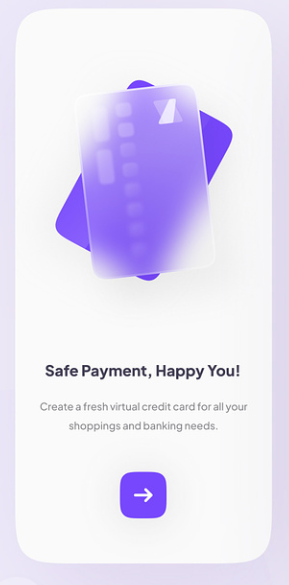
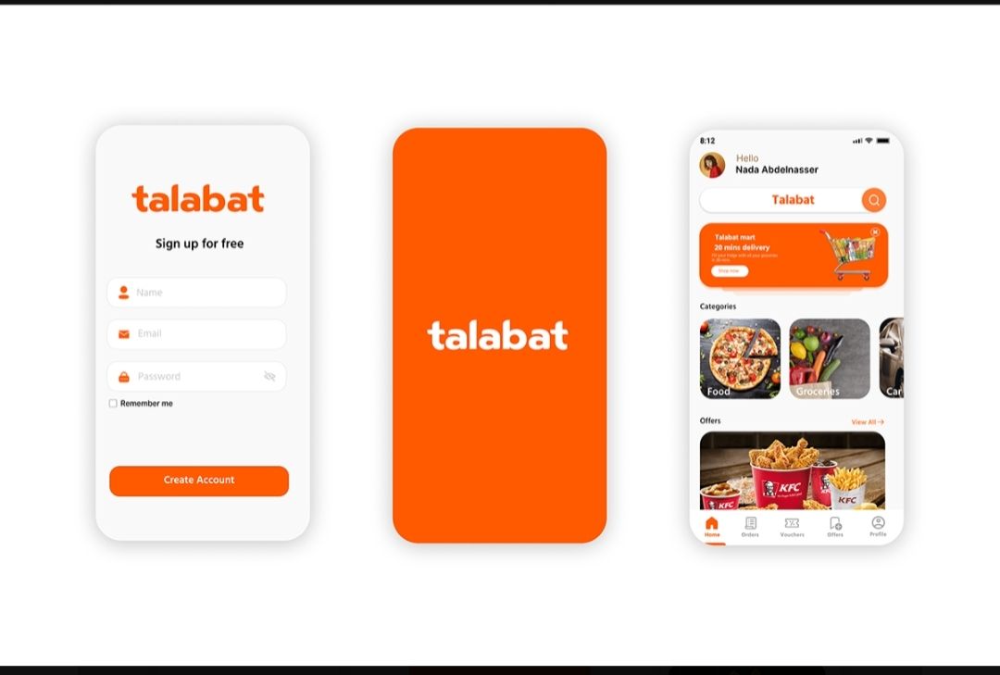

# Flutter Summer Training



This repository contains resources and projects related to the summer training program focused on Flutter app development.

## Table of Contents

- [Introduction](#introduction)
- [Projects](#projects)
- [Getting Started](#getting-started)

## Introduction

This repository is designed to support the Flutter Summer Training program, providing participants with hands-on experience in Flutter app development.
It includes sample projects, code snippets, and resources to help participants learn and build their skills.

## Projects

1. **Project 1:** Basic Flutter App - A simple app to get familiar with Flutter's structure and widgets.

2. **Project 2:** Talabat App - A task management app to understand state management in Flutter.


## Getting Started

1. Clone the repository:

   ```bash
   git clone https://github.com/farahmoataz90/Flutter_Summer_training.git

